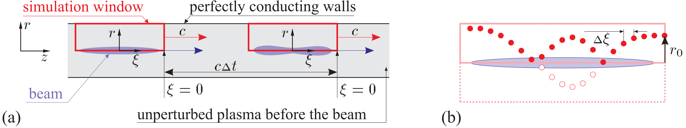

Basics
=======

In the code, the simulation window moves 
with the light velocity, and the quasistatic approximation is used for 
calculating plasma response. The beams and plasma are modeled by  
macro-particles. Transversely and longitudinally inhomogeneous plasmas and m
obile ions are possible. The code is furnished with extensive 
diagnosing tools which include the possibility of in-flight graphical 
presentation of the results.

The essence of the quasistatic approximation is illustrated by 
Figure 1 (cilindrical geometry). When we calculate the plasma response, 
the beam is considered as a ''rigid'' (not evolving in time) distribution of 
charges and currents which propagates with the speed of light :math:`c`. 
The fields generated by this beam depend on the longitudinal coordinate :math:`z` 
and time :math:`t` only in combination :math:`\xi=z-ct` and can be found 
layer-by-layer 
starting from the beam head. Since the beam is not changing, all particles 
started from some transverse position :math:`r_0` copy the motion of each other, 
and their parameters (transverse coordinate and momenta) can be found as 
functions of :math:`\xi`.
Thus, a plasma macroparticle in the quasistatic model is not a ''big''' 
particle, but a ''particle tube',' i.e., a group of real particles started 
from a given radius with a given initial momentum. This greatly reduces the 
memory required for storing plasma particles.

   Fig. 1: Geometry of the problem (a), and trajectory of 
   a plasma particle in the simulation window (b).

The calculated fields are then used to modify the beam. 
For highly relativistic beams, the time step :math:`\Delta t` for beam particles 
can be made large, which speeds up simulations several orders of magnitude. 
The quasistatic approximation is thus useful if and only if the time scale 
of beam evolution is much longer than the period of plasma wave.

Usful papers:
~~~~~~~~~~~~~

Various details of LCODE and underlying physics are described in the 
following papers:

.. #. K.V. Lotov, *Simulation of ultrarelativistic beam dynamics in plasma wake-field accelerator.* Phys. Plasmas **5**, 785 (1998). --- The fluid plasma model.

#. K.V. Lotov, *Fine wakefield structure in the blowout regime of plasma wakefield accelerators.* Phys. Rev. ST - Accel. Beams **6**, 061301 (2003). --- The beam model and the kinetic plasma model.

#. K.V. Lotov, *Blowout regimes of plasma wakefield acceleration.* Phys. Rev. E **69**, 046405 (2004). --- Energy fluxes in the co-propagating window. 

#.	K.V. Lotov, V.I. Maslov, I.N. Onishchenko, and E.N. Svistun, *Resonant excitation of plasma wakefields by a non-resonant train of short electron bunches.* Plasma Phys. Control. Fusion **52**, 065009 (2010). --- Discussion on applicability of quasistatic codes to simulations of long beams.

#. K.V. Lotov, A. Sosedkin, E. Mesyats, *Simulation of Self-modulating Particle Beams in Plasma Wakefield Accelerators.* Proceedings of IPAC2013 (Shanghai, China), p.1238-1240. --- Upgrade of the kinetic plasma solver which was necessary for simulations of long beams.

#. A.P. Sosedkin, K.V. Lotov, *LCODE: A parallel quasistatic code for computationally heavy problems of plasma wakefield acceleration.* Nuclear Instr. Methods A **829**, 350 (2016). --- Parallelization.

#. R.N. Spitsyn, *Numerical realization of quasistatic model of laser driver for plasma wakefield acceleration* (in Russian). Master theses, Novosibirsk State University (2016).