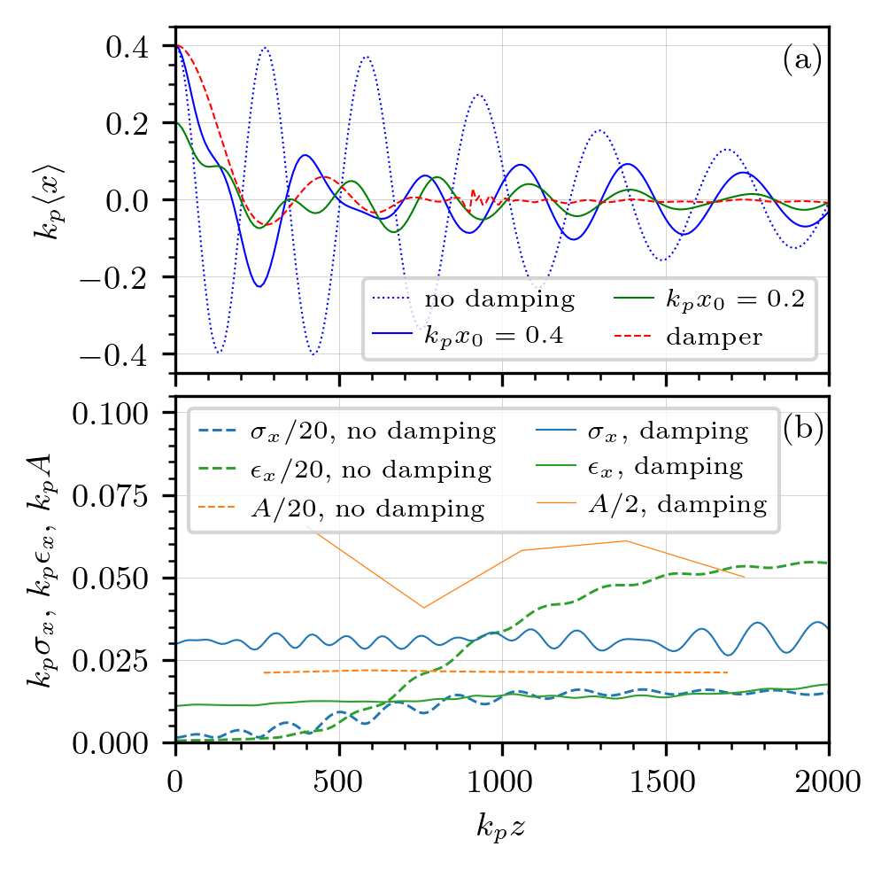
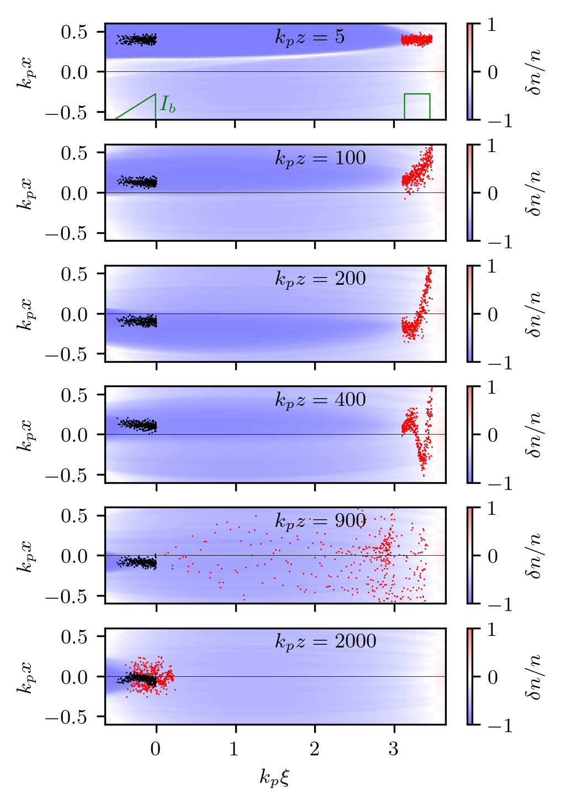

Oscillation damper for misaligned witness
---------------------------------------------------

This is a variant of the simulation of effective suppression of 
witness oscillations in case of misaligned injection.
See https://doi.org/10.1063/5.0239380 for detailed explanation of process.

* Code launcher:  :download:`run.py <damper/run.py>`.

* Post-processing (Jupyter notebook):
  :download:`damper-figs.ipynb <damper/damper-figs.ipynb>`
  and images that it produces: 

|fig4| |damp|

Code launcher:

.. literalinclude:: damper/run.py
   :language: python