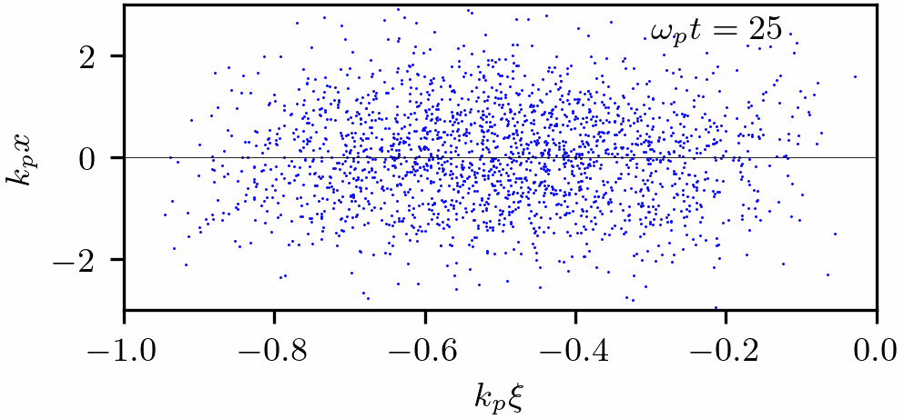
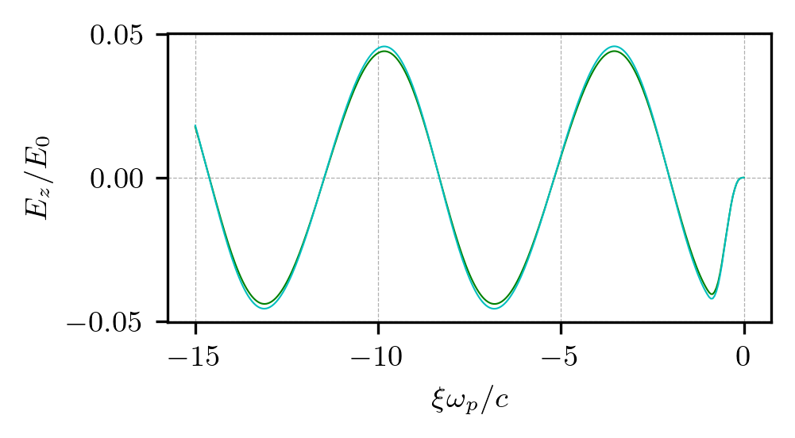
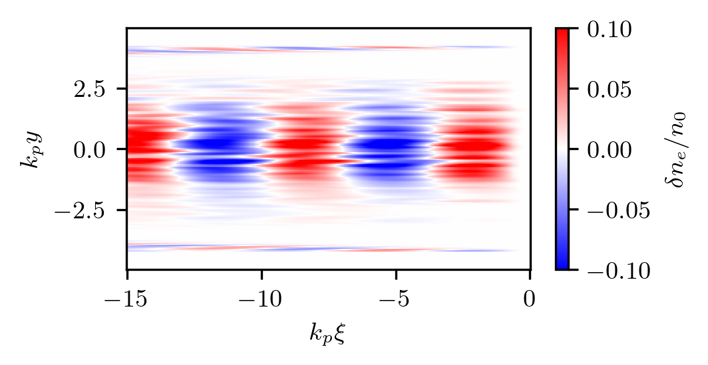

Default run of C-version
---------------------------------------------------

This is the default variant of the old LCODE written in C. 
Here, a short positively charged beam excites a linear wave and is slightly focused by it.

* Code launcher:  :download:`run.py <default-c/run.py>`.

* Post-processing (Jupyter notebook):  :download:`default-c-figs.ipynb <default-c/default-c-figs.ipynb>` and images that it produces: 

|ani| |Ez| |ne|

Code launcher (only options that differ from default values are listed):

.. literalinclude:: default-c/run.py
   :language: python