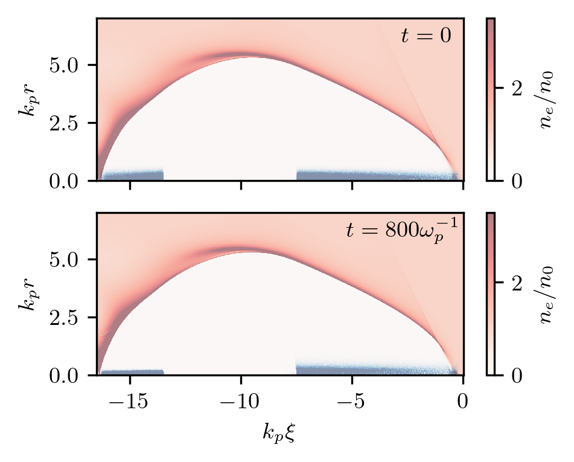
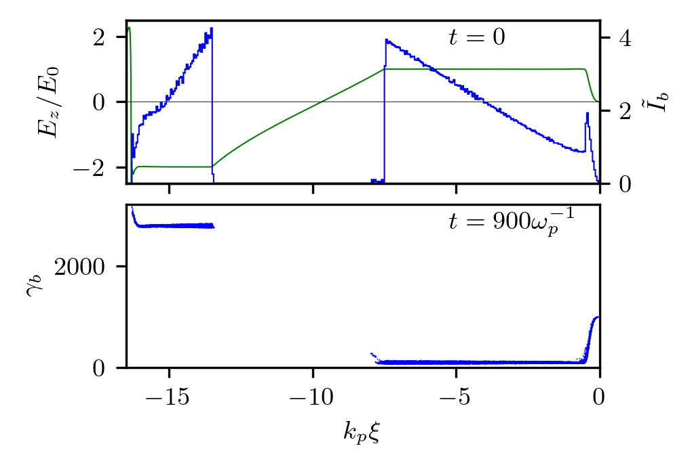

Efficient blowout regime
---------------------------------------------------

This is an example of highly efficient plasma wakefield acceleration in the bubble regime.
The run reproduces results shown in Fig.3 of the `paper <https://doi.org/10.1063/1.1889444>`_.
The results do not exactly coincide with those in the paper because of the reduced resolution.

* Code launcher:  :download:`high-R.py <high-R/high-R.py>`.

* Post-processing (Jupyter notebook):  :download:`high-R.ipynb <high-R/high-R.ipynb>` and images that it produces: 

|ne| |Ez|

Code launcher:

.. literalinclude:: high-R/high-R.py
   :language: python