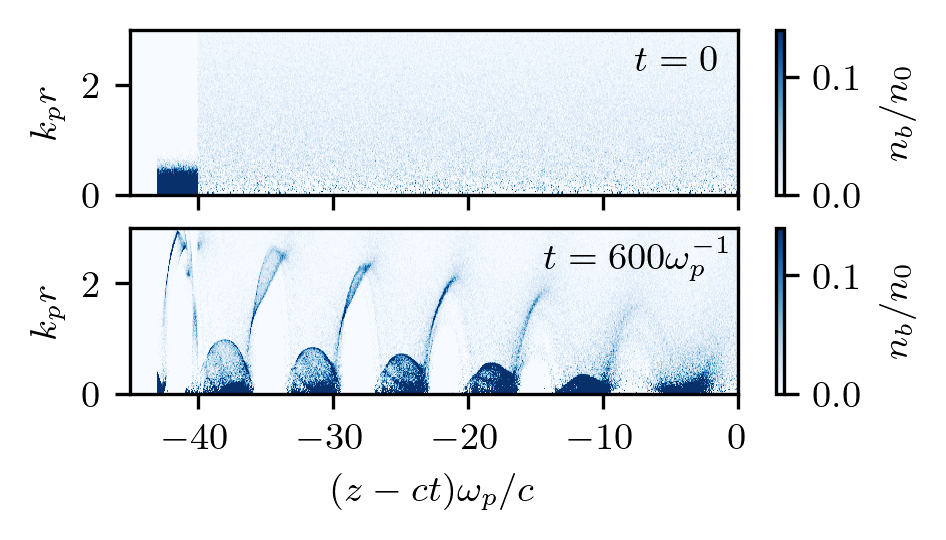
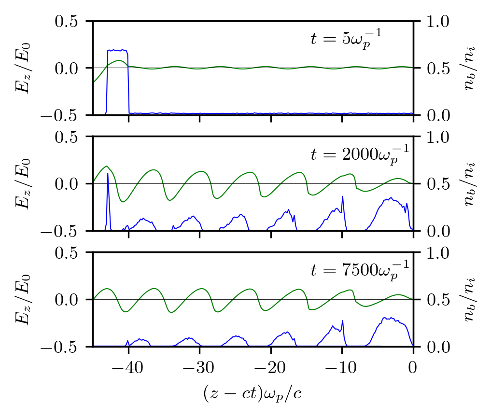

Seeded self-modulation
---------------------------------------------------

This is an example of seeded self-modulation of a particle beam.
The run reproduces results shown in Fig.2 of the `paper <https://accelconf.web.cern.ch/e98/PAPERS/MOP12E.PDF>`_ where the self-modulation effect was first discovered.
The results do not exactly coincide with those in the paper because the original figure was produced using a fluid plasma solver and much wider beam particles.

* Code launcher:  :download:`original-ssm.py <original-ssm/original-ssm.py>`.

* Post-processing (Jupyter notebook):  :download:`original-ssm-figs.ipynb <original-ssm/original-ssm-figs.ipynb>` and images that it produces: 

|nb| |Ez|

Code launcher:

.. literalinclude:: original-ssm/original-ssm.py
   :language: python