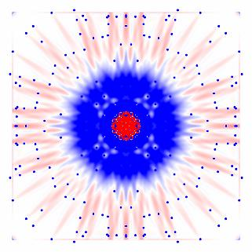
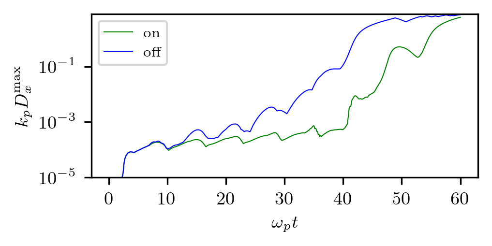
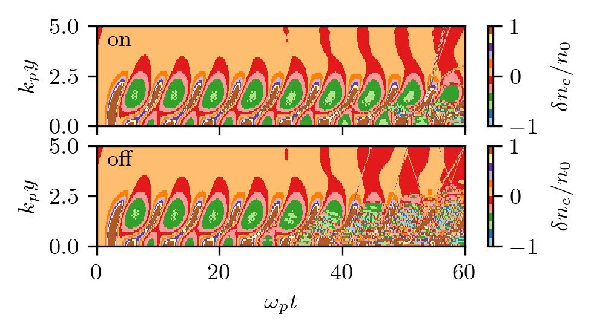

Transverse wavebreaking
---------------------------------------------------

This example shows transverse wavebreaking of a positron-driven nonlinear wakefield with declustering on and off.
The runs reproduce two lines in Fig.20 of `this paper <https://doi.org/10.48550/arXiv.2401.11924>`_.

.. note::
   

    Not ready yet
